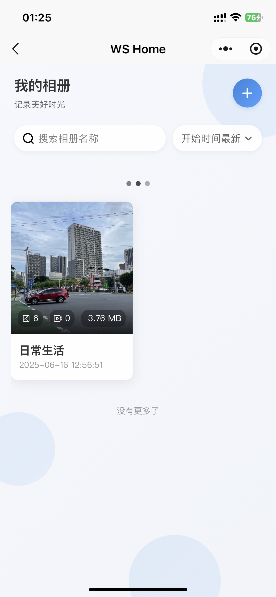
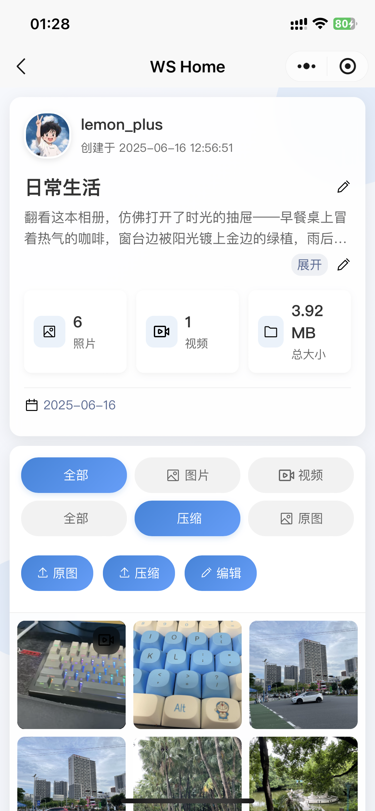
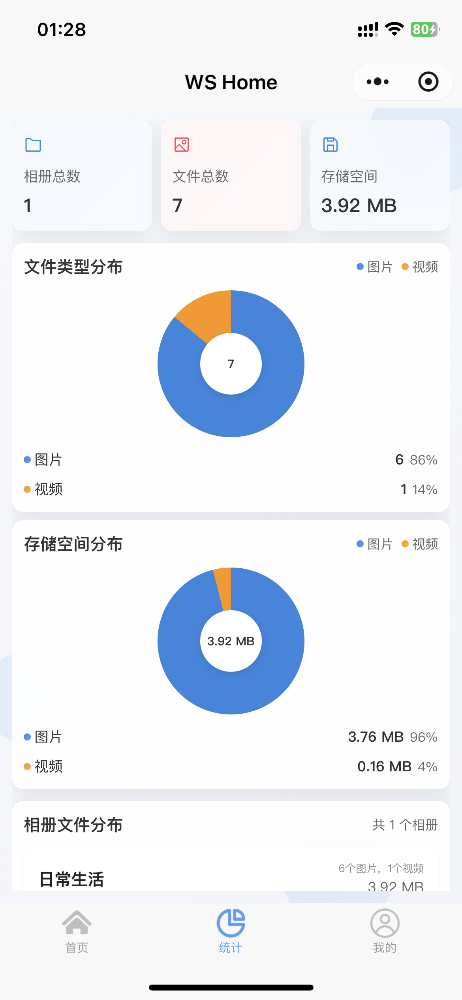

# 相册管理系统

基于 uni-app 开发的跨平台相册管理系统，支持多端运行，提供完整的相册管理功能。

> [前往后端](https://github.com/lemon-puls/txing-oj-backend)

> [前往 Web 端](https://github.com/lemon-puls/ws-home)

## ✨ 特性

- 📱 跨平台支持：一套代码，同时运行在 iOS、Android、H5、以及各种小程序平台
- 🎨 现代化 UI：采用 wot-design-uni 组件库，提供美观的用户界面
- 🔒 数据安全：支持本地存储和云端同步，确保数据安全
- 🚀 高性能：基于 Vue 3 + TypeScript 开发，提供流畅的用户体验
- 📦 模块化：采用组件化开发，代码结构清晰，易于维护
- 🌈 主题定制：支持自定义主题，满足个性化需求

## 📸 小程序演示

|                      首页                      |                      登录页                      |                      相册列表                      |
| :--------------------------------------------: | :----------------------------------------------: | :------------------------------------------------: |
|  |  |  |

|                      相册详情                      |                      统计数据                      |
| :------------------------------------------------: | :------------------------------------------------: |
|  |  |

## 🛠️ 技术栈

- 框架：Vue 3 + TypeScript
- 跨端框架：uni-app
- 状态管理：Pinia
- UI 组件：wot-design-uni
- 构建工具：Vite
- 代码规范：ESLint + Prettier
- 包管理器：pnpm

## 📦 安装

```bash
# 克隆项目
git clone git@github.com:lemon-puls/ws-home.uniapp.git

# 进入项目目录
cd ws-home.uniapp

# 安装依赖
pnpm install

# 启动开发服务器
pnpm dev:h5  # 开发 H5 版本
pnpm dev:mp-weixin  # 开发微信小程序版本
pnpm dev:app  # 开发 App 版本
```

## 🚀 开发

```bash
# 开发 H5 版本
pnpm dev:h5

# 开发微信小程序版本
pnpm dev:mp-weixin

# 开发 App 版本
pnpm dev:app

# 构建生产版本
pnpm build:h5  # 构建 H5 版本
pnpm build:mp-weixin  # 构建微信小程序版本
pnpm build:app  # 构建 App 版本
```

## 📁 项目结构

```
├── src                    # 源代码目录
│   ├── api               # API 接口
│   ├── components        # 公共组件
│   ├── pages            # 页面文件
│   ├── static           # 静态资源
│   ├── store            # 状态管理
│   ├── utils            # 工具函数
│   └── style            # 全局样式
├── env.sample           # 环境变量示例
├── vite.config.ts       # Vite 配置
└── package.json         # 项目依赖
```

## 🔧 环境要求

- Node.js >= 18
- pnpm >= 7.30

## 📝 开发规范

- 使用 TypeScript 进行开发
- 遵循 ESLint 和 Prettier 的代码规范
- 使用 Git Flow 工作流
- 遵循组件化开发原则

## 🤝 贡献指南

1. Fork 本仓库
2. 创建你的特性分支 (`git checkout -b feature/AmazingFeature`)
3. 提交你的更改 (`git commit -m 'Add some AmazingFeature'`)
4. 推送到分支 (`git push origin feature/AmazingFeature`)
5. 开启一个 Pull Request

感谢所有为本项目做出贡献的开发者！
